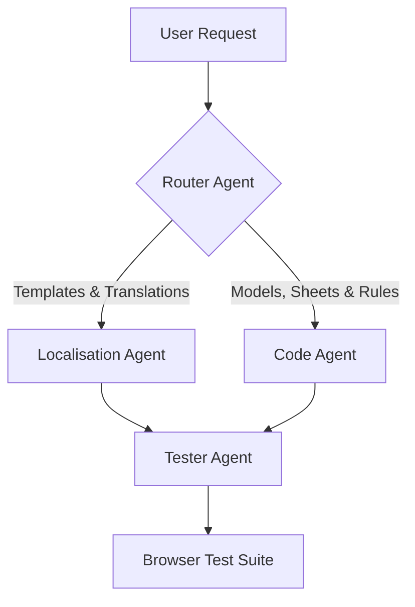

# 🧠 Foundry Router & Tester (Main Brain) Skill

This skill governs the central orchestrator (Main Brain) agent, which manages task routing, coordinates sub-agents, and designs browser-automated integration tests against a running Foundry V13 game instance.

---

## 🚦 Task Routing Architecture

When a development goal is received, the Router analyzes the requirements and assigns them to specialized agents:



### 1. The Localisation Agent
*   **Trigger**: Requested edits involve Handlebars templates (`.html`, `.hbs`), static text blocks, labels, translation strings, or multi-language JSON configurations.
*   **Guide**: Instructs the agent to utilize `.agent/skills/localization.md`.

### 2. The Code Agent
*   **Trigger**: Requested edits involve `models/` schemas, database mutations, Mixins, Action controllers in `sheets/`, custom widgets, or calculations in `services/`.
*   **Guide**: Instructs the agent to utilize `.agent/skills/understanding.md`.

---

## 🧪 Browser-Automated Integration Tests

Once the changes are completed, the Tester Agent must write an automated integration test placed inside `helpers/` (e.g., `helpers/test_shop_purchase.mjs`).

This test will target the active **Foundry VTT V13** local server (running on port `30013` or `30000`) and run checks inside a headless browser environment (using Puppeteer).

### The Reset-Edit-Assert Integration Testing Pattern
When writing integration tests that verify sheet UI input fields and backend database updates (like skill ratings, biography edits, or discounts), always follow the **Reset-Edit-Assert** cycle inside `page.evaluate()`:

1. **Reset**: Access the document directly via the Foundry API (`game.actors.get()`) and reset its values programmatically using `actor.updateEmbeddedDocuments()` or `actor.update()` to a baseline (e.g. `0` or blank). This ensures that the test results are not contaminated by stale state from previous runs.
2. **Edit**: Open the document sheet, transition to the correct sheet mode (e.g., `edit` mode), locate the relevant DOM elements or input fields, set their value, and dispatch a `change` event:
   ```javascript
   const input = sheet.element.querySelector('input[name="system.skills.active.negotiation.value"]');
   input.value = "5";
   input.dispatchEvent(new Event('change', { bubbles: true }));
   ```
3. **Assert**: Wait a short duration for database/rendering promises to fully resolve, re-fetch the actor from `game.actors`, and check if the authoritative database field successfully registered the change:
   ```javascript
   const updatedActor = game.actors.get(actorId);
   const updatedItem = updatedActor.items.get(itemId);
   const isSuccess = updatedItem.system.skill?.rating === 5;
   ```

### Scaffolding a Browser Test
We provide a standard scaffolding template located at [browser-tester-scaffold.mjs](file:///home/shadow/Documents/GitHub/sr5-marketplace/helpers/browser-tester-scaffold.mjs). 

A browser test should implement the following phases:
1.  **Launch & Navigate**: Start Puppeteer/Playwright and load the local Foundry instance.
2.  **Authenticate**: Auto-fill credentials to log in as a GM or Player:
    ```javascript
    // Select the player dropdown and select the GM/Player user
    await page.select('select[name="userid"]', gmUserId);
    await page.click('button[name="join"]');
    ```
3.  **Evaluate Code / Manipulate DOM**: Use `page.evaluate()` to perform the **Reset-Edit-Assert** loop:
    ```javascript
    const result = await page.evaluate(async () => {
        // Run internal Foundry API methods
        const actor = game.actors.get("ziPDQQFkPg98Wvr2");
        if (!actor) return { success: false, error: "Actor not found" };
        
        // 1. Reset
        const skill = actor.items.find(i => i.type === "skill" && i.name.toLowerCase() === "negotiation");
        await actor.updateEmbeddedDocuments("Item", [{ _id: skill.id, "system.skill.rating": 0 }]);
        
        // 2. Edit
        actor.sheet._mode = "edit";
        await actor.sheet.render(true);
        await new Promise(r => setTimeout(r, 1000));
        
        const input = actor.sheet.element.querySelector('input[name="system.skills.active.negotiation.value"]');
        input.value = "5";
        input.dispatchEvent(new Event('change', { bubbles: true }));
        await new Promise(r => setTimeout(r, 2000));
        
        // 3. Assert
        const actorAfter = game.actors.get("ziPDQQFkPg98Wvr2");
        const skillAfter = actorAfter.items.get(skill.id);
        const rating = skillAfter.system.skill?.rating;
        
        return { success: rating === 5, rating };
    });
    ```
4.  **Assert & Exit**: Print success/error codes and close the browser.

---

## 🏃 Running the Tests
To run your newly created browser-based integration tests:
1. Ensure the Foundry server is running locally on port 30000.
2. Install test dependencies if needed:
   ```bash
   npm install puppeteer --save-dev
   ```
3. Run the script from the workspace root:
   ```bash
   node helpers/test_my_feature.mjs
   ```
